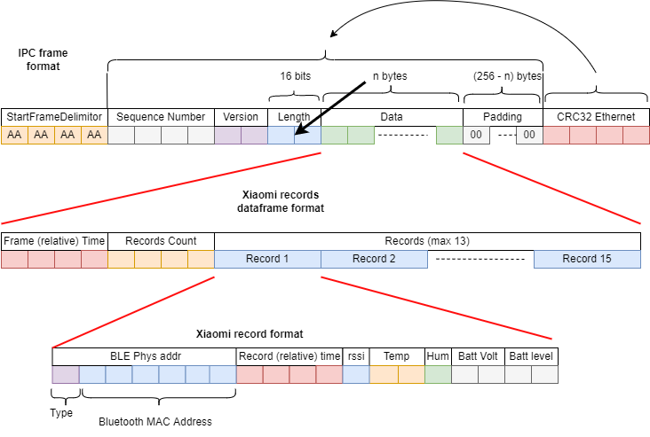

# BLE Xiaomi Mijia measurements collector application

This nrf52840 application scans and retrieves measurements from Xiaomi Mijia `LYWSD03MMC` devices, which are Bluetooth Low Energy (BLE) devices.

The measurements are embedded into records which are sent over the UART1 interface.

## Getting started

You will need :
- Xiaomi Mijia `LYWSD03MMC` devices with firmware version `1.0.0_0130`.
  - Firmware can be upgraded using "Xiaomi Home" app.
- nrf52840 based board.
- Zephyr RTOS toolchain.

Workspace can be created and application can be imported using `west` commands : 
- `west init -m https://github.com/lucasdietrich/zephyr-nrf52840-ble-dev --mr main myworkspace`
- `west update`
- Build project with `west build` command.
- Flash the application with `west -v flash -r nrfjprog --snr XXX` command, where XXX is the serial number of the board.

## Measurements

Measurements collected from Xiaomi devices are :

| Symbol | Measurement   | Unit | Maximum resolution |
| ------ | ------------- | ---- | ------------------ |
| T      | Temperature   | °C   | 1,00E-02           |
| H      | Humidity      | %    | 1,00E+00           |
| B      | Battery Level | V    | 1,00E-03           |

Measurements are retrieved periodically from devices.

## IPC Protocol (UART)
The IPC protocol is based on message of fixed length. IPC frame format is the following one :

UART configuration is  

| Option          | Value              |
| --------------- | ------------------ |
| Baudrate        | 1000000            |
| TX pin          | p1.02              |
| RX pin          | p1.01 (unecessary) |
| Parity          | NONE               |
| Stop bits       | 1                  |
| Data bits       | 8                  |
| RTS/CTS         | off                |
| HW flow control | off                |

Dataframe format is :



## Zephyr application-specific configuration options

| Configuration option                     | Description                                    | Unit    | Default Value |
| ---------------------------------------- | ---------------------------------------------- | ------- | ------------- |
| CONFIG\_XIAOMI\_MAX\_DEVICES             | Size of the table containing Xiaomi Devices    |         |               |
| CONFIG\_XIAOMI\_POLL\_INTERVAL           | What interval measurements should be retrieved | Seconds | 180           |
| CONFIG\_ACTIVE\_SCAN\_DURATION           | Active scan duration                           | Seconds | 20            |
| CONFIG\_ACTIVE\_SCAN\_PERIODICITY        | Active scan frequency                          | Ratio   | 3             |
| CONFIG\_PASSIVE\_SCAN\_MINUMUM\_DURATION | Minimum duration for a passive scan            | Seconds | 30            |

## Expected console output

```
[01:01:37.904,327] <inf> ble: Preparing 4 devices
[01:01:37.904,510] <inf> ble: Device 0: A4:C1:38:0A:1E:38 (public)
[01:01:37.904,663] <inf> ble: Device 1: A4:C1:38:68:05:63 (public)
[01:01:37.904,815] <inf> ble: Device 2: A4:C1:38:A7:30:C4 (public)
[01:01:37.904,968] <inf> ble: Device 3: A4:C1:38:8D:BA:B4 (public)
[01:01:39.084,136] <inf> ble: (20000cc0) Connected: A4:C1:38:0A:1E:38 (public)
[01:01:39.335,388] <err> ble: Failed to read measurements (ret -128)
[01:01:39.335,632] <inf> ble: (20000cc0) Disconnected: A4:C1:38:0A:1E:38 (public) (reason 0x3e)
[01:01:39.335,632] <inf> ble: (20002ca8) no valid measurements
[01:01:42.014,190] <inf> ble: (20000cc0) Connected: A4:C1:38:68:05:63 (public)
[01:01:42.165,710] <inf> ble: (20000cc0) Disconnected: A4:C1:38:68:05:63 (public) (reason 0x16)
[01:01:42.165,740] <inf> ble: T : 23.64 °C [ 2364 ], H 36 %, bat 2900 mV
[01:01:43.441,986] <inf> ble: (20000cc0) Connected: A4:C1:38:A7:30:C4 (public)
[01:01:43.643,524] <inf> ble: (20000cc0) Disconnected: A4:C1:38:A7:30:C4 (public) (reason 0x16)
[01:01:43.643,554] <inf> ble: T : 21.79 °C [ 2179 ], H 39 %, bat 2862 mV
[01:01:44.872,558] <inf> ble: (20000cc0) Connected: A4:C1:38:8D:BA:B4 (public)
[01:01:45.024,078] <inf> ble: (20000cc0) Disconnected: A4:C1:38:8D:BA:B4 (public) (reason 0x16)
[01:01:45.024,108] <inf> ble: T : 19.77 °C [ 1977 ], H 43 %, bat 2866 mV
[01:01:45.024,719] <inf> ipc: IPC TX frame: 274 B, seq = 26, data size = 248, sfd = aaaaaaaa, efd = 55555555 crc32=933b2ee6
```

## VS Code

This project is fully support by VS Code.

You might need to change tasks environment variables to match your setup in `.vscode/tasks.json` file.
```json
    "options": {
        "env": {
            "venvPath": "../.venv",
            "westPath": "../.venv/bin/west",
            "netToolsPath": "../tools/net-tools",
            "serialNumber": "683339521"
        }
    },
```

- You might to install `python` with required packages : 
  - `python -m virtualenv myworkspace/venv`
  - `source myworkspace/venv/bin/activate`
  - `pip install -r myworkspace/zephyr/scripts/requirements.txt`

- Monitor console `screen /dev/ttyACM0 115200`

## Sources / links :

- [lucasdietrich/AVRTOS : src/examples/zephyr-dev-usart-tool/main.c](https://github.com/lucasdietrich/AVRTOS/blob/drivers/src/examples/zephyr-dev-usart-tool/main.c)
- [./build/zephyr/zephyr.dts](./build/zephyr/zephyr.dts)
- [./build/zephyr/include/generated/autoconf.h](./build/zephyr/include/generated/autoconf.h)
- [**Xiaomi Mijia LYWSD03MMC : Récupérer les données du capteur sur un Raspberry Pi avec gatttool**](https://www.fanjoe.be/?p=3911)
